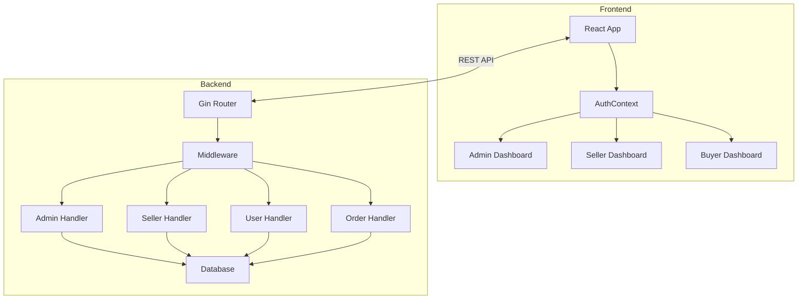
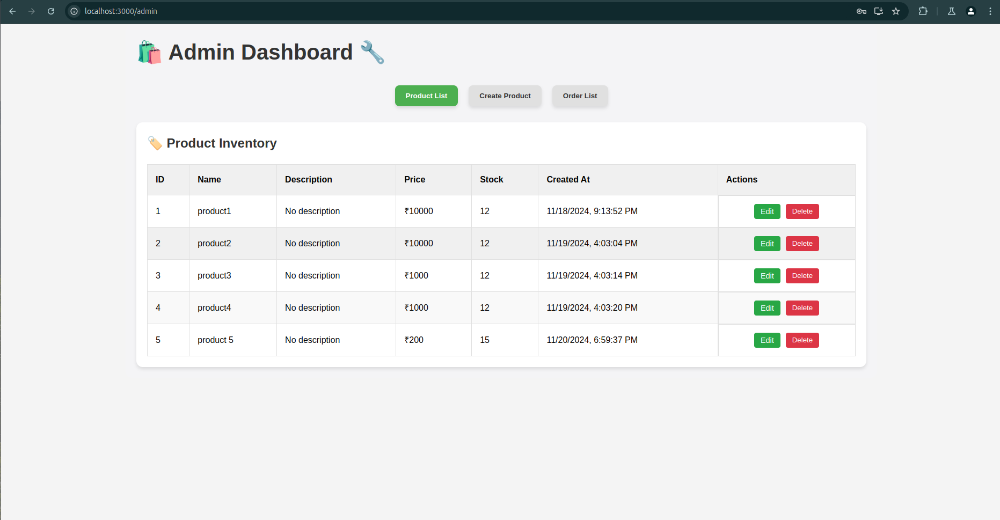
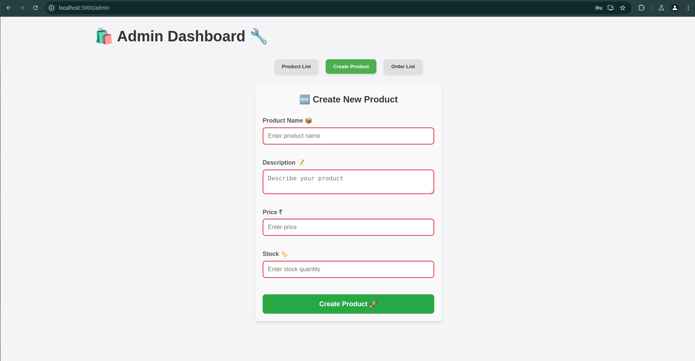
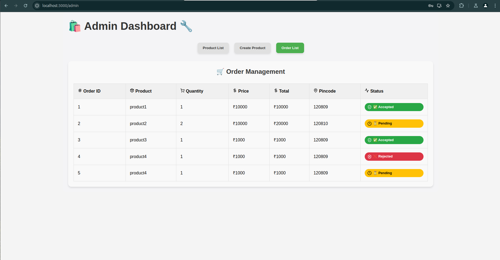
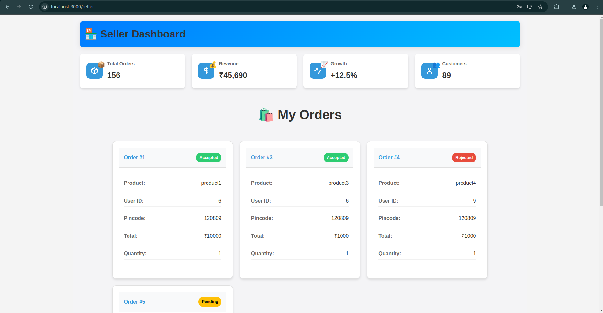
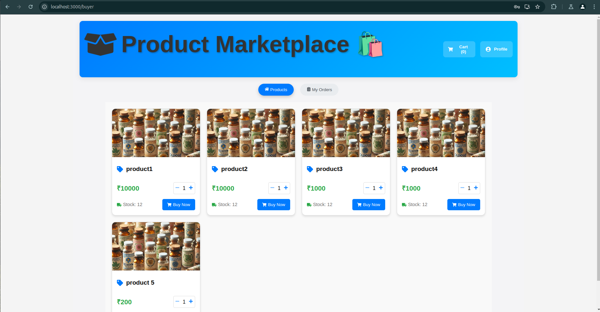
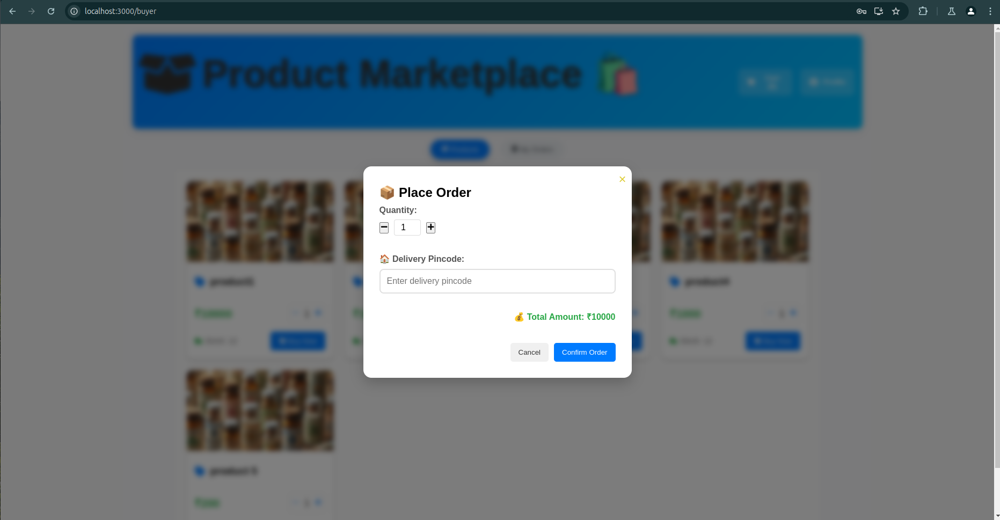
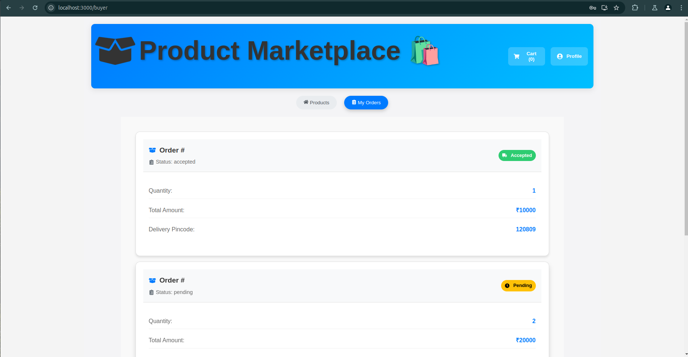

# 🏪 Medicine E-commerce Platform

A comprehensive e-commerce platform built with Go (backend) and React (frontend) for managing medicine sales and purchases with multiple user roles.

## 📋 Table of Contents

- [Features](#features)
- [Architecture](#architecture)
- [Tech Stack](#tech-stack)
- [Project Structure](#project-structure)
- [Models](#models)
- [API Endpoints](#api-endpoints)
- [Authentication & Authorization](#authentication--authorization)
- [Setup & Installation](#setup--installation)
- [Project Images](#project--images)

## ✨ Features

### 👥 User Roles
- **Admin** 🔑
  - Manage products
  - Create sellers
  - View all orders
  - Monitor platform activity
- **Seller** 💼
  - View assigned orders
  - Accept/Reject orders
  - Track sales and revenue
- **Buyer** 🛒
  - Browse products
  - Place orders
  - Track order status
  - Manage shopping cart

## 🏗 Architecture



## 🛠 Tech Stack

### Backend
- **Go** with **Gin Framework** 🚀
- **GORM** for database operations 📊
- **JWT** for authentication 🔐
- **PostgreSQL** database 🐘

### Frontend
- **React** for UI 📱
- **React Router** for navigation 🧭
- **Context API** for state management 🔄
- **Lucide React** for icons 🎨

## 📁 Project Structure

```
.
├── frontend/
│   ├── src/
│   │   ├── components/
│   │   │   ├── Auth/
│   │   │   ├── Dashboard/
│   │   │   └── Products/
│   │   ├── contexts/
│   │   ├── utils/
│   │   └── App.js
│   └── package.json
│
└── backend/
    ├── cmd/
    │   └── main.go
    ├── internal/
    │   ├── config/
    │   ├── database/
    │   ├── handlers/
    │   ├── middleware/
    │   └── models/
    └── go.mod
```

## 📊 Models

### User Model
```go
type User struct {
    gorm.Model
    Name     string   `json:"name"`
    Email    string   `json:"email"`
    Password string   `json:"password"`
    Phone    string   `json:"phone"`
    Address  string   `json:"address"`
    Pincode  string   `json:"pincode"`
    UserType UserType `json:"user_type"`
}
```

### Order Model
```go
type Order struct {
    gorm.Model
    UserID       uint
    SellerID     uint
    ProductID    uint
    ProductName  string
    Quantity     int
    Price        float64
    TotalAmount  float64
    Pincode      string
    Status       OrderStatus
    RejectReason string
}
```

### Product Model
```go
type Product struct {
    gorm.Model
    Name        string
    Description string
    Price       float64
    Stock       int
    AdminID     uint
}
```

## 🔌 API Endpoints

### Public Routes
- `POST /api/v1/register` - User registration
- `POST /api/v1/login` - User authentication
- `GET /api/v1/products` - List all products

### Protected Routes
#### Admin Routes
- `POST /api/v1/admin/products` - Create product
- `PUT /api/v1/admin/products/:id` - Update product
- `DELETE /api/v1/admin/products/:id` - Delete product
- `POST /api/v1/admin/sellers` - Create seller
- `GET /api/v1/admin/getallorders` - View all orders

#### Seller Routes
- `GET /api/v1/seller/orders` - View assigned orders
- `POST /api/v1/seller/orders/:id/respond` - Respond to order

#### User Routes
- `GET /api/v1/user/profile` - Get user profile
- `PUT /api/v1/user/profile` - Update user profile
- `POST /api/v1/orders` - Create order
- `GET /api/v1/orders` - Get user orders

## 🔒 Authentication & Authorization

The application uses JWT-based authentication with role-based access control:
1. User authenticates via `/login` endpoint
2. Backend generates JWT token
3. Frontend stores token in AuthContext
4. Token is included in Authorization header for protected routes
5. Middleware validates token and user role for protected routes

## 🚀 Setup & Installation

### Backend Setup
1. Install Go 1.16 or later
2. Clone the repository
3. Set up PostgreSQL database
4. Configure environment variables
5. Run:
```bash
cd backend
go mod download
go run cmd/main.go
```

### Frontend Setup
1. Install Node.js 14 or later
2. Navigate to frontend directory
3. Install dependencies:
```bash
cd frontend
npm install
npm start
```

## 📷 Screenshots

### Admin Dashboard







### Seller Dashboard


## Buyer Dashboard







## 🤝 Contributing

Please read CONTRIBUTING.md for details on our code of conduct and the process for submitting pull requests.

## 📄 License

This project is licensed under the MIT License - see the LICENSE.md file for details